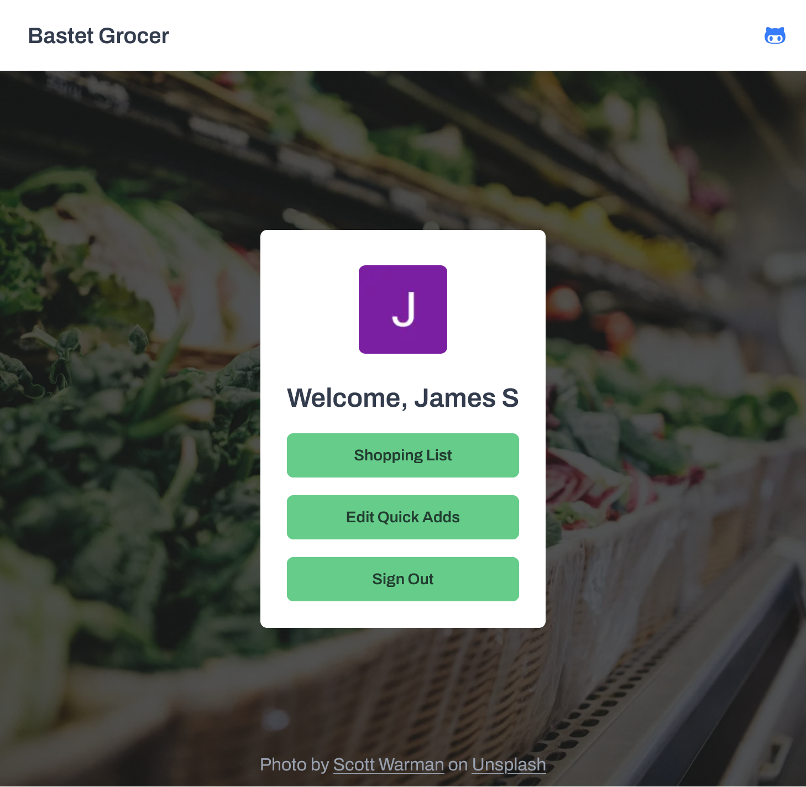
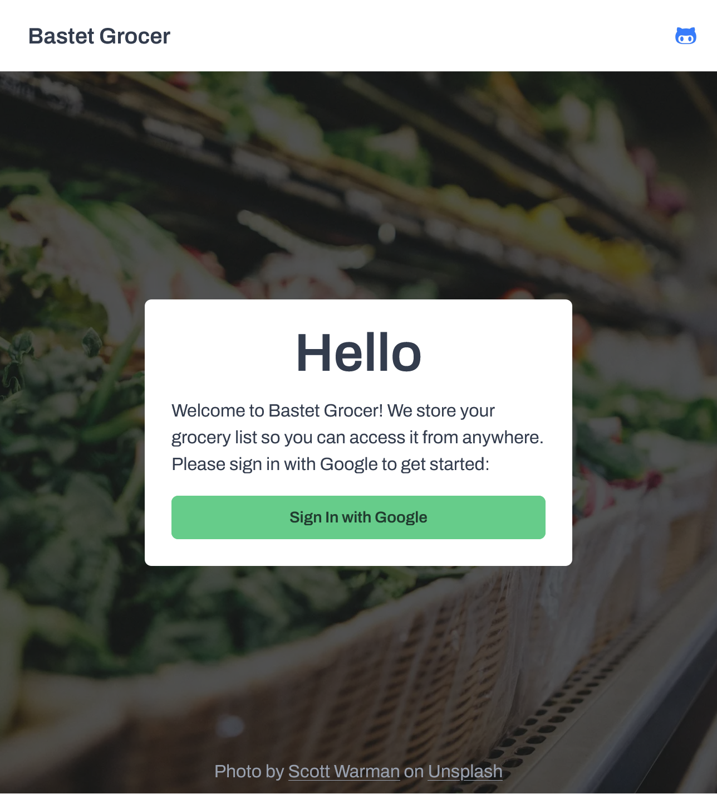
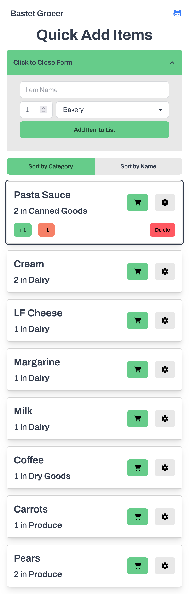

# Bastet Grocer

A web-based grocery list app designed to cut down on paper lists and help users organize their shopping lists more efficiently.



## Features

- **Organized shopping lists** – Categorize items for easier shopping.
- **Real-time updates** – Lists sync instantly using Firebase Firestore.
- **Authentication** – Secure login with Firebase Auth.
- **Mobile-friendly design** – Built with Tailwind CSS and DaisyUI.

## 📸 Screenshots

| Home Screen                             | Dashboard                            |
| --------------------------------------- | ------------------------------------ |
|  |  |

| Quick Adds                            | Shopping List                                |
| ------------------------------------- | -------------------------------------------- |
|  |  |

## Getting Started

To run this project locally, follow these steps:

### 1️⃣ Clone the Repository

```sh
git clone https://github.com/James-Sundby/bastet-grocer.git
cd bastet-grocer
```

### 2️⃣ Install Dependencies

```sh
npm install
# or
yarn install
```

### 3️⃣ Set Up Firebase

Create a .env.local file and add your Firebase API keys:

```in
    NEXT_PUBLIC_FIREBASE_API_KEY=your_api_key
    NEXT_PUBLIC_FIREBASE_AUTH_DOMAIN=your_auth_domain
    NEXT_PUBLIC_FIREBASE_PROJECT_ID=your_project_id
```

(If using Firestore, also set up database rules.)

### 4️⃣ Run the App

```sh
npm run dev

# or

yarn dev
```

The app will be available at http://localhost:3000

## Tech Stack

- Next.js – React framework
- Firebase – User authentication & Firestore database
- Tailwind CSS & DaisyUI – Styling

## Contributing

If you have suggestions or improvements, feel free to open an issue or submit a pull request.

## License

This project is open source and available under the [MIT License](LICENSE).
